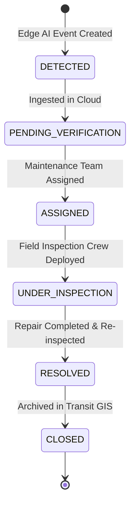

# MargaDrishti (मार्गदृष्टि) — SIH 2026 Technical Architecture Document
**Problem Statement ID: 26124** | **Bharat Electronics Limited (BEL)**  
**Theme:** Smart Automation | **Category:** Software  
**Tagline:** *Seeing Roads. Understanding Cities.*

---

## 1. Executive Summary & Design Rationale

Traditional urban sensing paradigms rely heavily on stationary CCTV cameras, periodic manual surveys, and citizen complaint apps. These suffer from:
- **Blind Spots**: Cameras only cover fixed intersections.
- **High Cloud Bandwidth Costs**: Streaming 1080p raw video 24/7 across thousands of cameras consumes gigabits per second of cellular data.
- **Delayed Intervention**: Potholes and road degradation are often reported weeks after severe damage has occurred.

**MargaDrishti** converts the municipal transit bus fleet into a **distributed mobile edge-AI sensor network**. Because public transit buses systematically cover almost every road segment daily, every bus acts as an intelligent inspector.

### Key Bandwidth Optimization Analysis
| Metric | Continuous Cloud Video Streaming | MargaDrishti Edge AI Processing |
| :--- | :--- | :--- |
| **Data Rate per Bus** | ~4.5 Mbps (H.264 1080p @ 15 FPS) | **~1.8 KB / event** (JSON telemetry + metadata) |
| **Daily Data (10h run)**| ~20.25 GB per bus / day | **~250 KB – 5 MB per bus / day** (events + selective evidence) |
| **Fleet of 500 Buses** | **~10.1 Terabytes / day** | **~1.2 Gigabytes / day** (99.98% bandwidth reduction) |
| **Cellular Dependency** | Constant high-bandwidth 5G link | Works offline with local SQLite queue, syncs on connectivity |

---

## 2. Hardware Deployment Profiles

MargaDrishti treats the underlying edge compute as an interchangeable deployment tier:

```
                  ┌─────────────────────────────────────────┐
                  │          EDGE COMPUTING TIER            │
                  └────────────────────┬────────────────────┘
                                       │
                ┌──────────────────────┴──────────────────────┐
                ↓                                             ↓
    ┌─────────────────────────┐                   ┌─────────────────────────┐
    │  TIER A: HIGH PERF      │                   │   TIER B: BUDGET        │
    │  NVIDIA Jetson AGX/Orin │                   │   Raspberry Pi 5        │
    │  + PyTorch / TensorRT   │                   │   + Google Coral TPU    │
    ├─────────────────────────┤                   ├─────────────────────────┤
    │ • Multi-camera support  │                   │ • Low power (10-15W)    │
    │ • High-FPS ANPR OCR     │                   │ • Low-cost fleet roll-out│
    │ • CUDA-accelerated post │                   │ • Quantized INT8 models │
    └─────────────────────────┘                   └─────────────────────────┘
```

---

## 3. The 3-Level Intelligence Framework

MargaDrishti is designed specifically to solve the progression required by transportation authorities:

1. **Level 1 — What Happened?**  
   *Event detection (e.g. Pothole / Damaged Road / Waterlogging).*
2. **Level 2 — Where and When?**  
   *Exact GPS coordinates (19.0760° N, 72.8777° E), transit corridor, bus ID (BUS_102), route (R12), and UTC timestamp.*
3. **Level 3 — What Impact Did It Have?**  
   *Speed reduction percentage calculated from preceding telemetry (drop from 34.1 km/h to 12.4 km/h = 63.6% reduction). Traffic density was normal; therefore **Road Defect** is the probable cause of the deceleration.*

---

## 4. Multi-Bus Repeated Event Confirmation (Spec Section 30)

When multiple buses independently log anomalies at the same location, the Cloud Aggregator applies spatio-temporal radius clustering:

```mermaid
graph TD
    B1[Bus 101 Logs Defect at 10:05] --> Agg[Cloud Spatio-Temporal Correlator]
    B2[Bus 107 Logs Defect at 12:50] --> Agg
    B3[Bus 114 Logs Defect at 14:15] --> Agg
    B4[Bus 102 Logs Defect at 15:32] --> Agg

    Agg --> Confirmed[Persistent Road Defect DEF_0041]
    Confirmed --> Stat[Observed by 4 buses | High Confidence 98%]
    Confirmed --> Work[Auto-Escalate to Maintenance Authority]
```

This fleet correlation fundamentally eliminates single-frame or single-vehicle false positives.

---

## 5. Authority Workflow State Machine (Spec Section 34)


